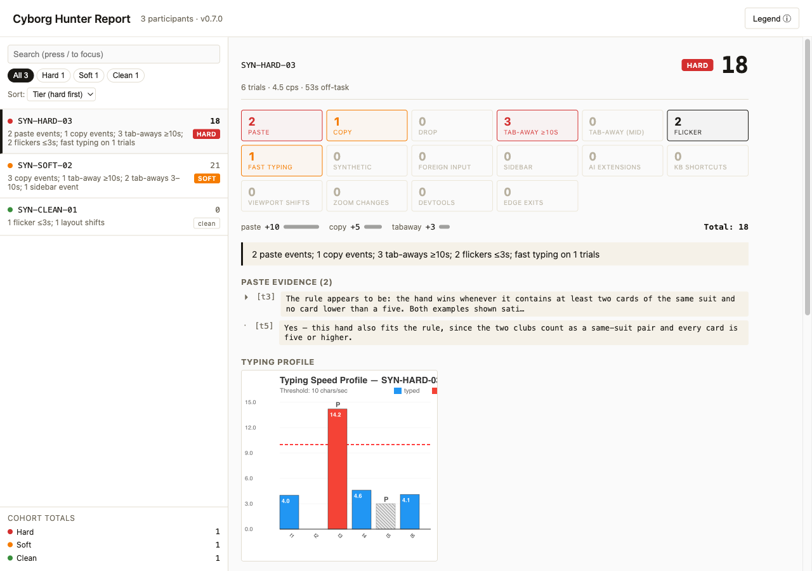

# cyborg-hunter

Detects AI-tool use during browser-based behavioral experiments. Captures paste, copy, drag, tab-away, mouse trajectories, browser sidebar openings, and other signals that compromise data quality on Prolific / MTurk / classroom studies. Produces a triage report ranking participants by suspiciousness.

Optional companion deterrence modules (`extension-guard-friction.js`, `extension-guard-honeypot.js`) ship in the same package: friction enforces fullscreen + blocks sidebars + scrambles content during violations + asks cooperative LLMs to refuse; honeypot exposes both hidden and visible bait fields that AI agents fill while human participants don't see them.

**[Try the live demo →](https://konukcan.github.io/cyborg-hunter/)** — run the tour in your browser; nothing leaves your machine.

### Example: what a report looks like

The bundled three-participant synthetic dataset (`examples/synthetic-pilot/` — every number hand-authored, no real participant behind any of it) triages like this:

| Rank | Participant | Tier | Score | Reason |
|------|-------------|------|-------|--------|
| 1 | SYN-HARD-03 | **HARD** | 18 | 2 paste events; 1 copy events; 3 tab-aways ≥10s; 2 flickers ≤3s; fast typing on 1 trials |
| 2 | SYN-SOFT-02 | soft | 21 | 3 copy events; 1 tab-away ≥10s; 2 tab-aways 3–10s; 1 sidebar event |
| 3 | SYN-CLEAN-01 | clean | 0 | 1 flicker ≤3s; 1 layout shifts |

Ranking is **tier-first** (hard-triggered lead, then soft, then clean), score-descending within a tier — rank 1 outranks rank 2 despite the lower score, because hard evidence beats any accumulation of soft evidence. The score is `5×paste + 5×copy + 3×sidebar + 1×tab-away` (counting tab-aways longer than the participant's tab-away threshold — 3s by default, 5s for the strict preset); synthetic insertions and fast typing are surfaced in the reason but do not drive the score. See [docs/cli-reference.md → Triage scoring](docs/cli-reference.md#triage-scoring). The HTML report for the same dataset:



Reproduce the table and page yourself: run `cyborg-hunter report` in `examples/synthetic-pilot/` ([docs/worked-example.md](docs/worked-example.md) interprets every number).

## Repo layout

- `src/core/` — signal-collection library (the monitor)
- `src/jspsych/` — jsPsych extension adapters (one per concern)
- `src/cli/` + `bin/` — CLI that turns saved data into the triage report
- `tests/`, `docs/` — tests, package docs
- `examples/synthetic-pilot/` — synthetic three-participant dataset for trying the CLI (see [docs/worked-example.md](docs/worked-example.md))

## Install

CLI (analysis):

```bash
npm install -g cyborg-hunter
```

Browser (experiment page) — load via unpkg or copy `dist/*.js` into your project:

```html
<!-- Signal collection -->
<script src="https://unpkg.com/cyborg-hunter/dist/cyborg-hunter.min.js"></script>
<script src="https://unpkg.com/cyborg-hunter/dist/extension-cyborg-hunter.js"></script>
<!-- Optional: deterrence + bait detection -->
<script src="https://unpkg.com/cyborg-hunter/dist/extension-guard-friction.js"></script>
<script src="https://unpkg.com/cyborg-hunter/dist/extension-guard-honeypot.js"></script>
<!-- Optional: session replay recorder -->
<script src="https://unpkg.com/cyborg-hunter/dist/cyborg-hunter-replay.js"></script>
```

For production studies, pin a version: `https://unpkg.com/cyborg-hunter@0.7.1/dist/...`.

## Plug into a jsPsych experiment

```javascript
const jsPsych = initJsPsych({
  extensions: [
    { type: jsPsychCyborgHunter, params: { participantId: participant_id, preset: 'standard' } },
    { type: jsPsychGuardFriction },     // optional
    { type: jsPsychGuardHoneypot }      // optional
  ],
  on_finish: function () {
    jsPsych.extensions['guard-friction'].finalize();   // stop friction first
    jsPsych.extensions['guard-honeypot'].finalize();   // then attach data
    jsPsych.extensions['cyborg-hunter'].finalize();    // then save
    jsPsych.data.get().localSave('csv', 'data.csv');
  }
});

timeline.push(jsPsychGuardFriction.entryTrial());     // user-gesture fullscreen entry
timeline.forEach(t => t.extensions = (t.extensions || []).concat([
  { type: jsPsychCyborgHunter },
  { type: jsPsychGuardFriction },
  { type: jsPsychGuardHoneypot }
]));
jsPsych.run(timeline);
```

`participantId` must exist before `initJsPsych`. Full walk-through (per-trial params, standalone non-jsPsych use, opt-in/exclude modes): [docs/using-cyborg-hunter.md](docs/using-cyborg-hunter.md).

## Generate a report

```bash
cd <your-data-dir>
cyborg-hunter init                # writes cyborg-hunter.config.json
# edit config: dataDir, filePattern, participantIdField
cyborg-hunter report              # writes ./cyborg-hunter-report/
open cyborg-hunter-report/index.html
```

Output: `summary.csv` (per-participant columns), `triage.md` (ranked list), `event-log.csv` (chronological events), `images/` (per-participant mouse paths, session timelines, typing profiles), `index.html` (landing page).

## Session replay

The optional replay recorder captures what the participant did and (at the
`dom` tier) what the page looked like, so a flagged session can be reviewed
visually instead of adjudicated from counts alone. Recordings use jsPsych
PR #3661's `SessionRecording v1` wire format with a `ch_extensions` block.

```javascript
// jsPsych: one more extension (declare anywhere; finalize LAST)
{ type: jsPsychCyborgHunterReplay, params: {
    participantId: participant_id,
    tier: 'dom',                                          // 'trace' (default) | 'dom'
    autoSave: { mode: 'datapipe', experimentId: 'ABC123' } } }
// on_finish: await jsPsych.extensions['cyborg-hunter-replay'].finalize();
```

```javascript
// Standalone (any experiment, no jsPsych)
const rec = CyborgHunterReplay.attach({ participantId, tier: 'dom',
  autoSave: { mode: 'datapipe', experimentId: 'ABC123' } });
rec.startSession();
rec.startTrial({ trialId: 'r1' });   // optional bracketing
rec.endTrial();
rec.stopSession('finished');
await rec.autoSaveNow();
```

The artifact saves as `<pid>-replay-<epoch>.json` next to your data; the CLI
picks it up automatically and the report gains a **Session replay** section
per participant (lazy-loaded scrub viewer — cursor trail, clicks, away
bands, and a sandboxed reconstruction of the page for `dom`-tier
recordings). On `dom`-tier recordings the cursor is verified per
interaction by a five-way alignment self-check — any click it can't
confirm draws an explicit uncertain marker instead of a wrong one, and
recordings made before this guarantee existed replay under a reduced-
guarantees banner. Password fields are always redacted; see
[docs/using-cyborg-hunter.md](docs/using-cyborg-hunter.md) for the privacy
model, data-volume guidance, delivery semantics, and the alignment
guarantee in full.

## What it detects

| Signal | How | Class |
|---|---|---|
| Paste | Clipboard `paste` events | Hard (count threshold) |
| Drag-and-drop | `drop` events on inputs | Hard (count threshold) |
| Copy | Clipboard `copy` events | Soft (weighted) |
| Tab-away | `visibilitychange` + `blur`/`focus` | Soft (weighted) |
| Browser sidebar | `innerWidth` delta + layout compression | Soft (weighted) |
| Suspicious typing speed | chars/sec exceeding preset threshold | Soft (weighted) |
| Synthetic insertion | text appearing without keystrokes | Diagnostic (collected, not scored) |
| Foreign input | typing landing outside experiment container | Soft (weighted) |
| Idle gaps | input inactivity | Diagnostic (collected, not scored) |
| AI-extension content scripts | DOM scan for known extension selectors | Diagnostic (collected, not scored) |
| Mouse trajectories | 20Hz polling + path-efficiency metrics | Diagnostic |
| Window/screen geometry | polled + resize-event capture, with zoom inference | Diagnostic |

Three presets: `permissive` / `standard` (default) / `strict`. Per-signal thresholds: [docs/signals-reference.md](docs/signals-reference.md).

Tab-aways are captured session-wide, not just during trials: since 0.6.1 the session report keeps a timestamped `tabAwayEvents[]` for every tab-away — including those during consent, tutorial, or study phases — so session timelines can place them. Data saved with older versions keeps only durations (`tabAwaySums`) for off-trial events; the timeline footer counts those as unplaceable. (0.6.1 also renames the `layoutShifts` signal to `viewportWidthShifts` — it measures viewport-width changes, not Web-Vitals CLS — keeping the old key as a deprecated alias.)

The optional **guard** extensions add: fullscreen / sidebar / focus enforcement (with content-scrambling overlay on violation), AI refusal notices in the DOM, and honeypot fields (hidden + visible bait) that catch sidebar-LLMs and agentic browsers (Browser Use, Operator, Computer Use). The visible bait writes `ai_use` / `ai_report` columns into your saved data, and the report surfaces them in `summary.csv` as `honeypot_ai_use` / `honeypot_ai_report` (plus a "self-reported AI use" note in the triage reason).

## What it doesn't detect

- **Native browser AI sidebars** (Chrome Gemini, Edge Copilot) — they leave no extension content scripts. The `innerWidth_delta` heuristic still catches them as generic sidebar events, but the named-extension column stays empty.
- **Screen-share / second device** — an LLM on a phone reading the screen leaves no in-browser trace.
- **AI text edited and retyped** — a determined participant who retypes character-by-character without tab-switching looks clean. Mouse-trajectory and typing-rhythm signals raise the bar but it isn't a polygraph.

## Documentation

- [docs/quickstart.md](docs/quickstart.md) — zero to triage report
- [docs/worked-example.md](docs/worked-example.md) — full pipeline run on the bundled synthetic dataset, outputs interpreted
- [docs/interpreting-signals.md](docs/interpreting-signals.md) — scores vs tiers, viewport shifts, phase scoping: the common misreadings
- [docs/release-notes-0.7.0.md](docs/release-notes-0.7.0.md) — what 0.7.0 (and 0.6.2) change in data, config, and reports
- [docs/release-notes-0.6.1.md](docs/release-notes-0.6.1.md) — the 0.6.1 release notes
- [docs/using-cyborg-hunter.md](docs/using-cyborg-hunter.md) — full integration guide
- [docs/signals-reference.md](docs/signals-reference.md) — every signal with thresholds per preset
- [docs/configuration.md](docs/configuration.md) — config file fields and CLI flags
- [docs/cli-reference.md](docs/cli-reference.md) — commands and output structure

## Development

Run the test suite with `npm test`. Before publishing, run `scripts/check-public-hygiene.sh` — it fails if any tracked file contains personal or internal-process leakage.

## Citation

```bibtex
@software{konuk_cyborg_hunter,
  author  = {Konuk, Can and Btesh, Victor and Nunez, Jose Luis},
  title   = {cyborg-hunter: detecting AI-tool use in browser-based behavioral experiments},
  year    = {2026},
  version = {0.7.1},
  url     = {https://github.com/konukcan/cyborg-hunter},
  license = {MIT}
}
```

A "Cite this repository" button is rendered from `CITATION.cff`.

## License

MIT
